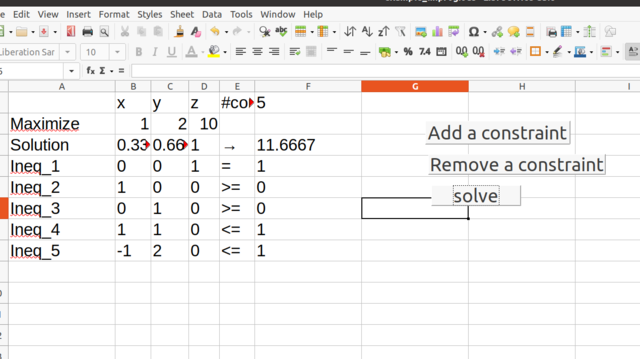

# libreoffice calc macro demo 

## Installation 
 
* Setup python 
  1. Install [python 3.x](https://www.python.org/downloads/windows/)
  2. Install [scipy](https://www.scipy.org/install.html) module of python

* Setup libreoffice calc
  1. Install [libreoffice](https://www.libreoffice.org/download/download/) 
  2. In libreoffice calc, enable executing downloaded macros by 
  Tools->Options->LibreOffice->Security->Macro Security->Low
  

* Minor changes in the code
  1. Open example_linprog.ods using libreoffice calc
  2. Open the macro editor by Tools->Macros->Edit Macros, 
  3. In the 'Object Catalog', double click example_linprog.ods->Standard->Solve
  4. Edit the file names and the shell command appropriately. 

* Get ready for the class
  1. In libreoffice calc, make the form control menu visible by View->Toolbars->Form Controls

## What is this 

A simple demonstration of linear optimization solver app in libreoffice calc. It includes 
* Macros using APIs for 
  * reading/writing from/to cells
  * reading/writing from/to csv files
  * interacting with external python script 
* Buttons for running the macros
* drop-down lists

